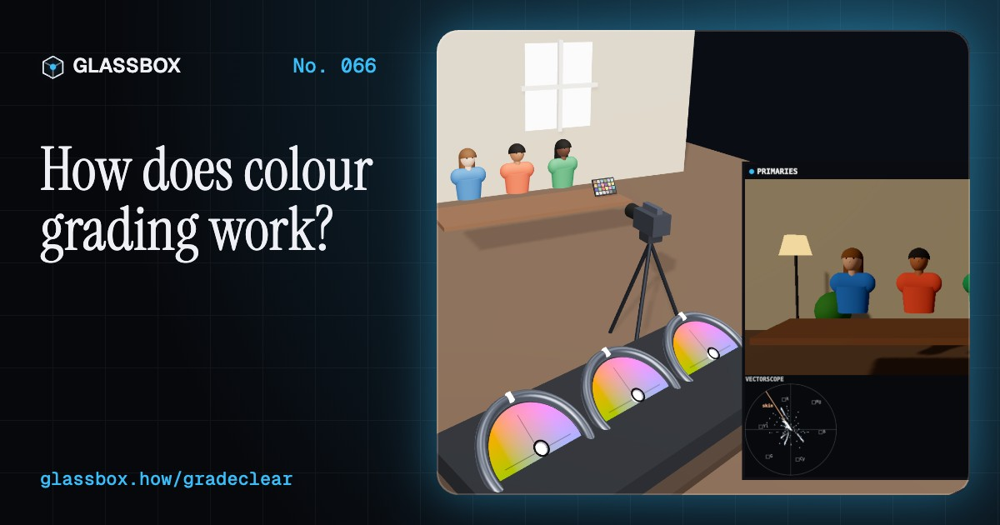
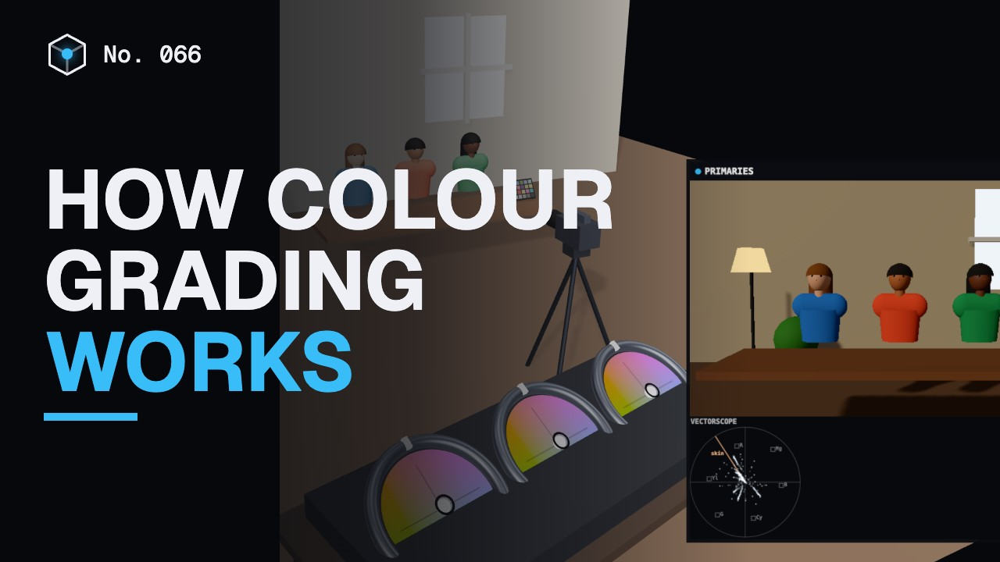
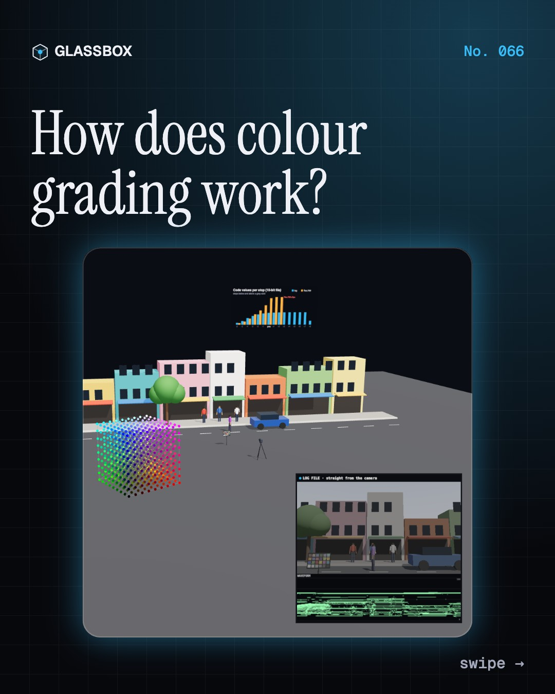
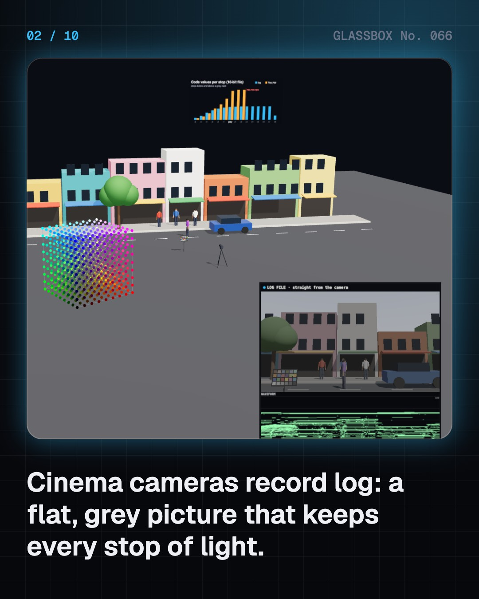
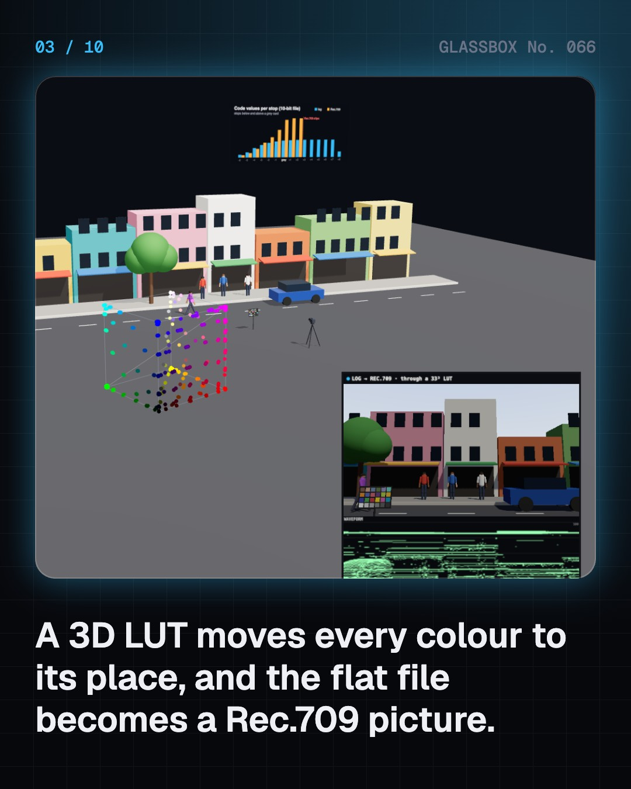
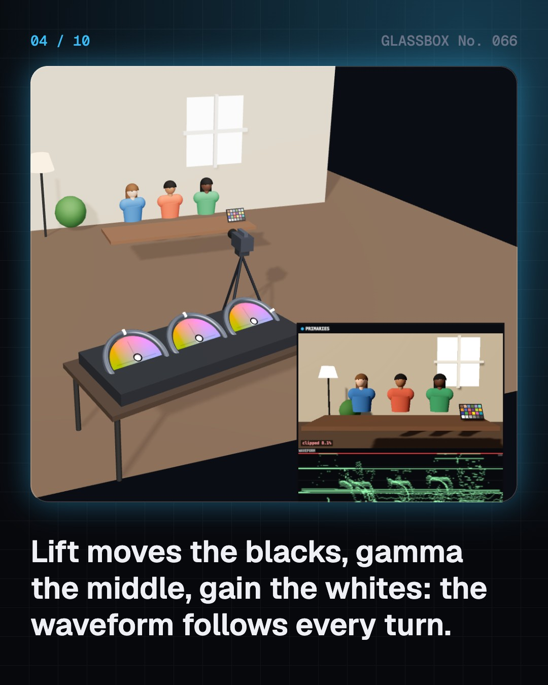

<!-- glassbox:start -->
<!-- Generated from glassbox.json by the Glassbox hub (npm run readme -- gradeclear). Edit glassbox.json, not this block. -->
<p align="center"><a href="https://glassbox.how/e/gradeclear/"></a></p>

<h1 align="center">GradeClear</h1>

<p align="center"><b>How does colour grading work?</b><br>Film a street, three faces and a sunset in 3D, then grade them yourself. A real grading pipeline runs on your graphics card: log footage through a 3D LUT, lift, gamma and gain wheels you can drag, live waveform, parade and vectorscope, a tracked power window, teal and orange, and HDR in nits.</p>

<p align="center"><a href="https://glassbox.how/gradeclear/"><b>▶ Play with it</b></a> &nbsp;·&nbsp; <a href="https://glassbox.how/e/gradeclear/">Read the 60-second explainer</a> &nbsp;·&nbsp; <a href="https://glassbox.how/gradeclear/glassbox/reel.mp4">Watch the 40-second video</a></p>

<p align="center">
  <a href="https://glassbox.how/e/gradeclear/"></a>
  <a href="https://glassbox.how/e/gradeclear/"></a>
  <a href="LICENSE"></a>
  <a href="LICENSE-CONTENT.md"></a>
  <a href="#privacy"></a>
</p>

## In 60 seconds

1. **Log keeps the light, a LUT makes it watchable.** Cinema cameras record log: a flat, grey file that keeps about 7.8 stops above a grey card, where a Rec.709 video file clips just 2.5 stops up. A 3D LUT, a cube of input and output colours, turns log into a normal picture.
2. **Lift, gamma, gain, checked on scopes.** Three colour wheels move the shadows, mid-tones and highlights. Colourists trust scopes over their eyes: the waveform shows brightness from 0 to 100, the RGB parade shows balance, and the vectorscope shows hue, with every skin tone near one line at about 123°.
3. **Matching shots.** Shots filmed hours apart, on different cameras, must cut together. Balance a grey chart until red, green and blue line up on the parade, match its level, then match saturation. Grading can fix colour and brightness, but not the direction of the light.
4. **Secondaries change only part of the picture.** A qualifier selects a range of hue, saturation and brightness, like only the sky or one shirt. A power window is a soft shape, tracked to follow a moving face. Strong looks always hold skin tones out, so faces stay natural.
5. **The look.** Teal and orange works because the two are complementary and skin sits on the orange side. Bleach bypass, film print emulation, day for night, sepia and noir are other classic looks, stored as creative LUTs and applied shot by shot.
6. **Delivery: nits and gamuts.** SDR is graded for 100 nits of white, cinema screens about 48, and HDR TVs reach 1,000 or more, giving highlights far more room. Rec.709 covers about a third of visible colours on the CIE diagram, Rec.2020 about two thirds (nearer three quarters by other measures). Suites are dim and neutral grey so the colourist's eyes are not fooled.

## Words worth knowing

| Term | Meaning |
|---|---|
| **Log** | A recording curve that gives each stop of light a similar share of code values, keeping huge dynamic range. |
| **LUT** | A lookup table: a list (1D) or cube (3D) of input colours and the output colours they become. |
| **Lift, gamma, gain** | Controls for the shadows, mid-tones and highlights of a picture. |
| **Waveform** | A scope plotting the brightness of every column of the picture from 0 to 100. |
| **Vectorscope** | A round scope showing hue as angle and saturation as distance from the centre. |
| **Qualifier** | A selection made from a range of hue, saturation and brightness. |
| **Power window** | A soft shape that limits where a correction applies, often tracked to a moving subject. |
| **Nit** | A unit of screen brightness: one candela per square metre. |
| **Gamut** | The range of colours a screen or standard can show. |

## A short history

**From women painting film frames with tiny brushes in Paris to colourists shaping HDR pictures on free software in Mumbai and Hollywood.**

- **1905** · Colour cut out with stencils (Pathé Frères, with Segundo de Chomón, Paris, France)
- **1932** · Three strips of film, full colour (Walt Disney and Technicolor, Hollywood, USA)
- **1950** · Colour on one strip of film (Eastman Kodak, Rochester, USA)
- **1965** · The timer and the printer lights (Film laboratory colour timers, Hollywood, USA, and labs worldwide)
- **1984** · da Vinci is born in Florida (Video Tape Associates, then da Vinci Systems, Florida, USA)
- **1992** · Film becomes numbers in log (Kodak Cineon, Rochester, USA)
- **2000** · A whole film graded on a computer (Joel and Ethan Coen, Roger Deakins and Cinesite, Los Angeles, USA)
- **2003** · India's first fully graded film (Prime Focus, Mumbai, India)

The full story, with 29 moments, charts, people and 50 sources: [glassbox.how/e/gradeclear/history](https://glassbox.how/e/gradeclear/history/). The data lives in [`history.json`](history.json).

## Video and slides

Made with the Glassbox studio from this box's storyboard (`window.glassbox.director`). Free to reuse under CC BY 4.0.

<a href="https://glassbox.how/gradeclear/glassbox/video.mp4"></a>

<p><a href="glassbox/slide-1.jpg"></a> <a href="glassbox/slide-2.jpg"></a> <a href="glassbox/slide-3.jpg"></a> <a href="glassbox/slide-4.jpg"></a></p>

| File | What | Size |
|---|---|---|
| [`glassbox/reel.mp4`](https://glassbox.how/gradeclear/glassbox/reel.mp4) | Reel / Short, with captions and soundtrack | 1080×1920 |
| [`glassbox/video.mp4`](https://glassbox.how/gradeclear/glassbox/video.mp4) | YouTube video, with captions and soundtrack | 1920×1080 |
| `glassbox/slide-1…10.jpg` | Instagram carousel | 1080×1350 |
| `glassbox/thumb.jpg` | YouTube thumbnail | 1280×720 |
| `glassbox/cover.jpg` | Share card and repo social preview | 1200×630 |
| [`glassbox/history-reel.mp4`](https://glassbox.how/gradeclear/glassbox/history-reel.mp4) | “History in 10 moments” Reel / Short | 1080×1920 |
| `glassbox/history-slide-*.jpg` | History carousel | 1080×1350 |
| `glassbox/post.json` | Post copy and schedule used by the publish kit | |

## Privacy

This box has no accounts and no ads, and it ships its own fonts and libraries. When you run it yourself it sends nothing anywhere. On glassbox.how, the site's `/bar.js` also loads Glassbox's analytics: **Google Analytics** to count visits (it asks first in the EU, UK and Switzerland, and stays off when your browser sends Global Privacy Control or Do Not Track) and **ClickTrust** to detect bots.

It remembers a few things **in your own browser only**, and never sends them anywhere:

| Browser storage key | What it holds |
|---|---|
| `gradeclear.v1` | Which chapters you have opened, your best quiz scores, and sound on or off. |

Exactly what each one sees is at [glassbox.how/privacy](https://glassbox.how/privacy/).

## Licences

- **Code:** [MIT](LICENSE). Use it, change it, ship it.
- **Explanations, text, images and videos** (`glassbox.json`, `glassbox/`): [CC BY 4.0](LICENSE-CONTENT.md). Credit “Glassbox, glassbox.how/e/gradeclear”.
- **Third-party parts** keep their own licences: [three.js](https://threejs.org) (MIT), [Geist, Instrument Serif](https://openfontlicense.org) (SIL OFL 1.1).
- The Glassbox name and logo aren't covered by either licence. See the [terms](https://glassbox.how/terms/).

Found a mistake? [Open an issue](https://github.com/bdeeps/gradeclear/issues). Corrections happen in public.
<!-- glassbox:end -->

## Run it

It's plain HTML, CSS and JavaScript. No build step and no dependencies. Run locally, it contacts no other website.

```bash
python3 -m http.server 8000
```

Three.js and the fonts ship in `vendor/` and `fonts/`, so it also works offline.

Then open http://localhost:8000.

## How it's built

| File | What |
|---|---|
| `index.html`, `css/app.css` | The page and its styles |
| `js/app.js`, `js/stage.js`, `js/ui.js`, `js/kit.js` | The shared Glassbox 3D engine: chapters, 3D stage, controls, quiz, video director |
| `js/chapters/*.js` | One file per chapter: the 3D model, controls, text, key terms, quiz and video scenes |
| `js/grade.js` | The grading pipeline: log and Rec.709 maths, 3D LUT baking, the grade shader, live scopes, the monitor, the sets (street, faces, sunset), colour wheels and looks |
| `glassbox.json` | Title, question, explainer beats, key terms, browser storage and credits shown on glassbox.how |
| `reel` in each chapter | The storyboard the Glassbox studio records into short videos |
| `glassbox/` | The published video, slides, thumbnail and post copy |
| `fonts/`, `vendor/three/` | Self-hosted Geist and Instrument Serif (SIL OFL 1.1) and three.js (MIT) |
